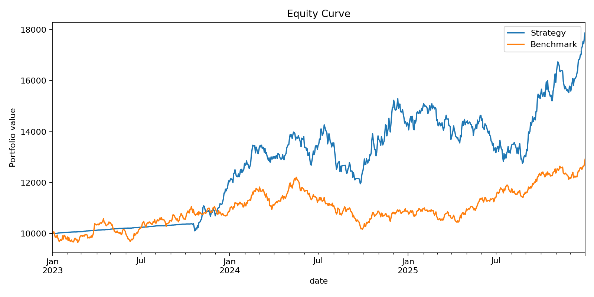
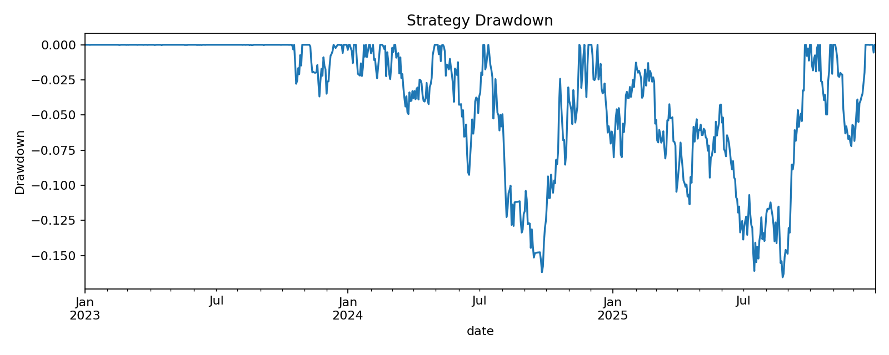

# Agentic Trader Test Report

## Strategy vs Benchmark

| Metric | Strategy | Benchmark |
|---|---:|---:|
| total_return | 78.85% | 29.17% |
| cagr | 21.42% | 8.92% |
| annualized_volatility | 16.33% | 10.60% |
| sharpe | 1.23 | 0.83 |
| sortino | 1.74 | 1.37 |
| max_drawdown | -16.55% | -16.70% |
| calmar | 1.29 | 0.53 |

Trades: 10

## Top Parameter Sets

|   fast_ma |   slow_ma |   momentum_lookback |   start_value |   end_value |   total_return |     cagr |   annualized_volatility |   sharpe |   sortino |   max_drawdown |   calmar |   win_rate_days |   best_day |   worst_day |   avg_win_day |   avg_loss_day |   num_trades |   turnover_per_year |
|----------:|----------:|--------------------:|--------------:|------------:|---------------:|---------:|------------------------:|---------:|----------:|---------------:|---------:|----------------:|-----------:|------------:|--------------:|---------------:|-------------:|--------------------:|
|        20 |       100 |                 120 |         10000 |     21355.9 |       1.13559  | 0.288294 |                0.164692 |  1.56567 |   2.33925 |      -0.124252 |  2.32023 |        0.578544 |  0.0378897 |  -0.0308972 |    0.0072406  |    -0.00799615 |           13 |             4.34027 |
|        50 |       100 |                 120 |         10000 |     21355.9 |       1.13559  | 0.288294 |                0.164692 |  1.56567 |   2.33925 |      -0.124252 |  2.32023 |        0.578544 |  0.0378897 |  -0.0308972 |    0.0072406  |    -0.00799615 |           13 |             4.34027 |
|        20 |       100 |                  90 |         10000 |     20347.3 |       1.03473  | 0.267653 |                0.170126 |  1.42939 |   2.13566 |      -0.164425 |  1.62781 |        0.573436 |  0.0482711 |  -0.0308972 |    0.00753095 |    -0.00830954 |           17 |             5.67573 |
|        50 |       100 |                  90 |         10000 |     20347.3 |       1.03473  | 0.267653 |                0.170126 |  1.42939 |   2.13566 |      -0.164425 |  1.62781 |        0.573436 |  0.0482711 |  -0.0308972 |    0.00753095 |    -0.00830954 |           17 |             5.67573 |
|        20 |       150 |                  90 |         10000 |     19395.4 |       0.939535 | 0.247535 |                0.166688 |  1.36278 |   1.99192 |      -0.154195 |  1.60533 |        0.587484 |  0.0482711 |  -0.0308972 |    0.00696737 |    -0.00833058 |           13 |             4.34027 |
|        50 |       150 |                  90 |         10000 |     19395.4 |       0.939535 | 0.247535 |                0.166688 |  1.36278 |   1.99192 |      -0.154195 |  1.60533 |        0.587484 |  0.0482711 |  -0.0308972 |    0.00696737 |    -0.00833058 |           13 |             4.34027 |
|        20 |       150 |                 120 |         10000 |     19038.6 |       0.903858 | 0.239826 |                0.163452 |  1.34994 |   1.97188 |      -0.129921 |  1.84594 |        0.586207 |  0.0378897 |  -0.0308972 |    0.00683374 |    -0.00814317 |           14 |             4.67413 |
|        50 |       150 |                 120 |         10000 |     19038.6 |       0.903858 | 0.239826 |                0.163452 |  1.34994 |   1.97188 |      -0.129921 |  1.84594 |        0.586207 |  0.0378897 |  -0.0308972 |    0.00683374 |    -0.00814317 |           14 |             4.67413 |
|        20 |       200 |                 120 |         10000 |     18473.6 |       0.847363 | 0.227419 |                0.162228 |  1.29908 |   1.87549 |      -0.161912 |  1.40459 |        0.587484 |  0.0378897 |  -0.0310732 |    0.00662647 |    -0.00822459 |           14 |             4.67413 |
|        50 |       200 |                 120 |         10000 |     18473.6 |       0.847363 | 0.227419 |                0.162228 |  1.29908 |   1.87549 |      -0.161912 |  1.40459 |        0.587484 |  0.0378897 |  -0.0310732 |    0.00662647 |    -0.00822459 |           14 |             4.67413 |

## Monte Carlo Bootstrap Summary

| metric       |           p05 |          p25 |       median |          p75 |          p95 |
|:-------------|--------------:|-------------:|-------------:|-------------:|-------------:|
| total_return |     0.169219  |     0.47008  |     0.787066 |     1.14306  |     1.85978  |
| cagr         |     0.0536319 |     0.137419 |     0.214111 |     0.290097 |     0.420672 |
| max_drawdown |    -0.26477   |    -0.207428 |    -0.166014 |    -0.13569  |    -0.109645 |
| sharpe       |     0.388669  |     0.826914 |     1.23076  |     1.55562  |     2.12853  |
| end_value    | 11789.8       | 14677.9      | 17830.7      | 21396.9      | 28698        |

## Notes

This test harness is for research only. It does not prove future profitability and does not account for every real-world execution issue.